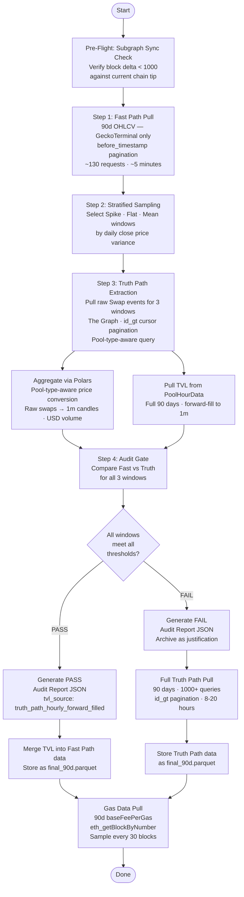

# Architecture: Base DEX Data Acquisition Layer

**Specification Reference:** TRD v1.5

---

## 1. System Overview

The pipeline implements a **Hybrid Ingestion Workflow** with three distinct concerns:

1. **Ingestion** — Collect 90 days of market and network data
2. **Verification** — Audit the fast-path data against on-chain ground truth
3. **Storage** — Persist approved datasets for ML feature engineering

The central design principle is that **no data reaches the ML training phase without passing a quantitative audit gate.** Speed and accuracy are balanced through a two-path architecture: a fast bulk download path (GeckoTerminal), verified by a targeted on-chain extraction (The Graph + Base RPC).

---

## 2. Component Map

```
┌─────────────────────────────────────────────────────────────────┐
│                     EXTERNAL DATA SOURCES                        │
│                                                                  │
│  ┌─────────────────┐   ┌─────────────────┐   ┌──────────────┐  │
│  │  GeckoTerminal  │   │   The Graph /   │   │   Alchemy    │  │
│  │  (REST API)     │   │  Aerodrome Sub- │   │  (Base RPC)  │  │
│  │  OHLCV only     │   │  graph (GraphQL)│   │              │  │
│  │  No TVL         │   │  Swaps + TVL    │   │  Gas data    │  │
│  └────────┬────────┘   └────────┬────────┘   └──────┬───────┘  │
└───────────┼─────────────────────┼───────────────────┼──────────┘
            │                     │                   │
            ▼                     ▼                   ▼
┌─────────────────────────────────────────────────────────────────┐
│                        INGESTION                                 │
│                                                                  │
│   fast_path.py          truth_path.py            gas.py         │
│   (OHLCV only)          (Swaps + TVL)        (baseFeePerGas)    │
│   [httpx]               [httpx + web3.py]    [web3.py]          │
│                         [pool-type aware]                        │
└────────────────────────────┬─────────────────────────────────────┘
                             │
                             ▼
┌─────────────────────────────────────────────────────────────────┐
│                      AGGREGATION                                 │
│                                                                  │
│         aggregator.py — Pool-Type-Aware Polars Aggregation       │
│                                                                  │
│   CL Pool (WETH/USDC)          Classic Pool (AERO/WETH)         │
│   sqrtPriceX96 → price         reserve1/reserve0 → price        │
│   group_by_dynamic → candles   group_by_dynamic → candles        │
│   Volume_USD = Σ(amt × price)  Volume_USD = Σ(amt × price)      │
└────────────────────────────┬─────────────────────────────────────┘
                             │
                             ▼
┌─────────────────────────────────────────────────────────────────┐
│                       AUDIT                                      │
│                                                                  │
│   sampler.py            comparator.py           report.py        │
│   (Stratified window    (Metric calculation)    (JSON output)    │
│    selection)                                                     │
└────────────────────────────┬─────────────────────────────────────┘
                             │
                    ┌────────┴────────┐
                    │  DECISION GATE  │
                    │  PASS / FAIL    │
                    └────────┬────────┘
               ┌─────────────┴─────────────┐
               ▼                           ▼
         PASS PATH                    FAIL PATH
         (Fast Path OHLCV           (Full Truth Path
          approved)                  pull — 1,000+ queries)
               │                           │
               └─────────────┬─────────────┘
                             │
                    TVL merge (always Truth Path,
                    hourly forward-filled)
                             │
                             ▼
┌─────────────────────────────────────────────────────────────────┐
│                      FINAL STORAGE                               │
│                                                                  │
│       data/base_mainnet/pairs/WETH_USDC/final_90d.parquet        │
│       data/base_mainnet/pairs/AERO_WETH/final_90d.parquet        │
│       data/base_mainnet/pairs/<PAIR>/audit_log.json              │
│       data/base_mainnet/network/gas_prices_90d.parquet           │
└─────────────────────────────────────────────────────────────────┘
```

---

## 3. Data Flow: The Hybrid Ingestion Workflow



---

## 4. Pool Type Architecture

The two target pairs use fundamentally different on-chain mechanisms. All Truth Path code must branch on pool type.

### 4.1 WETH/USDC — CL (Slipstream) Pool

| Property | Value |
|---|---|
| Pool Address | `0xb2cc224c1c9feE385f8ad6a55b4d94E92359DC59` |
| Type | Concentrated Liquidity (Uniswap v3-style) |
| Tick Spacing | 100 |
| Swap Fee | 0.05% |
| Price Encoding | `sqrtPriceX96` |

**Price conversion from `sqrtPriceX96`:**
```python
def cl_price(sqrt_price_x96: int, token0_decimals: int, token1_decimals: int) -> float:
    price_raw = (sqrt_price_x96 / (2 ** 96)) ** 2
    return price_raw * (10 ** token0_decimals) / (10 ** token1_decimals)

# For WETH (18 decimals) / USDC (6 decimals):
# price_usdc_per_weth = (sqrtPriceX96 / 2**96) ** 2 * (10**18) / (10**6)
```

**Subgraph swap entity fields (CL):**
```graphql
{
  id
  timestamp
  amount0       # token0 delta (negative = out of pool)
  amount1       # token1 delta (negative = out of pool)
  sqrtPriceX96  # pool sqrt price after swap
  tick          # current tick after swap
  amountUSD     # USD value of swap
  transaction { id blockNumber }
}
```

### 4.2 AERO/WETH — Classic vAMM Pool

| Property | Value |
|---|---|
| Pool Address | `0x7f670f78b17dec44d5ef68a48740b6f8849cc2e6` |
| Type | Classic Volatile (Velodrome/Solidly x*y=k) |
| Tick Spacing | N/A — full-range liquidity |
| Swap Fee | 0.30% |
| Price Encoding | Reserve ratio |

**Price derivation from reserves:**
```python
def classic_price(amount0_in: float, amount0_out: float,
                  amount1_in: float, amount1_out: float) -> float:
    if amount0_out > 0:
        return amount1_in / amount0_out   # selling token0
    else:
        return amount1_out / amount0_in   # buying token0
```

**Subgraph swap entity fields (Classic):**
```graphql
{
  id
  timestamp
  amount0In
  amount0Out
  amount1In
  amount1Out
  amountUSD
  sender
  to
  transaction { id blockNumber }
}
```

> ⚠️ **Always verify field names via schema introspection before writing production queries:**
> ```graphql
> { __type(name: "Swap") { fields { name type { name kind } } } }
> ```

---

## 5. The Audit Decision Gate

### 5.1 Stratified Sampling Logic

| Window | Selection Rule | What It Tests |
|---|---|---|
| **Spike** | Day with maximum σ² | API behavior under high volatility |
| **Flat** | Day with minimum σ² | API accuracy during low activity |
| **Mean** | Day closest to median σ² | General baseline accuracy |

### 5.2 Audit Thresholds (TRD v1.5)

Three metrics determine whether the Fast Path data is approved for ML training:

| Metric | Target | Why It Matters for DEX Signal Generation |
|---|---|---|
| **MAE** | < 0.10% | Price error must stay below minimum signal threshold or model learns wrong signals |
| **Volume Error** | < 1% | Volume is a key ML feature — systematic error corrupts feature magnitude |
| **Dropped Candles** | 0 | Missing real swap activity creates time series gaps. Zero-volume ghost candles excluded. |
| **TVL Error** | null | No Fast Path TVL — not a fail condition. TVL always from Truth Path. |
| **Filled Candles** | Info only | Empty windows (no swaps) forward-filled by Fast Path — logged, not gated |

**Not included:** Pearson correlation was removed in TRD v1.5. It is a securities-market statistical tool inappropriate for DEX data validation. It fails mechanically on low-variance days due to methodology differences between GeckoTerminal's TWAP-style pricing and on-chain last-swap prices, even when the data is perfectly usable for signal generation. MAE captures what matters: is the price error small enough that the model learns correct signals?

### 5.3 TVL Path

TVL always comes from the Truth Path regardless of audit verdict:
- Source: `PoolHourData` entity from The Graph
- Resolution: Hourly, forward-filled to 1-minute buckets
- Audit report field: `tvl_source: "truth_path_hourly_forward_filled"`
- `tvl_error_pct`: always `null` — no Fast Path TVL to compare against

---

## 6. The Graph Pagination

**All GraphQL queries must use `id_gt` cursor pagination.** The `skip` parameter has a hard ceiling of 5,000 records and will silently truncate high-volume pair datasets. All three audit windows exceeded 22,000+ swap records — `skip` would have failed on every one.

```python
last_id = ""
all_swaps = []

while True:
    result = run_query(SWAPS_QUERY, variables={
        "pool": pool_address.lower(),
        "startTs": start_unix_ts,
        "endTs": end_unix_ts,
        "lastId": last_id
    })
    swaps = result["data"]["swaps"]
    if not swaps:
        break
    all_swaps.extend(swaps)
    last_id = swaps[-1]["id"]
    time.sleep(0.25)
```

---

## 7. Storage Schema

### 7.1 OHLCV + TVL Parquet

| Column | Type | Description |
|---|---|---|
| `timestamp` | `Datetime[us, UTC]` | 1-minute bucket start |
| `open` | `Float64` | First swap price in bucket |
| `high` | `Float64` | Highest swap price |
| `low` | `Float64` | Lowest swap price |
| `close` | `Float64` | Last swap price |
| `volume_usd` | `Float64` | Σ(Amount_token × Price_swap) in USD |
| `tvl_usd` | `Float64` | Hourly TVL forward-filled to 1-minute |

### 7.2 Gas Parquet

| Column | Type | Description |
|---|---|---|
| `timestamp` | `Datetime[us, UTC]` | Block timestamp |
| `block_number` | `Int64` | Block number |
| `base_fee_gwei` | `Float64` | `baseFeePerGas` ÷ 1e9 |

---

## 8. Key Technology Decisions

**GeckoTerminal as Fast Path:** DexScreener has no historical OHLCV endpoint. GeckoTerminal provides 6 months of 1-minute history, free tier, no auth, clean `before_timestamp` pagination — the only viable option.

**Polars for aggregation:** `group_by_dynamic` aggregates millions of raw swap events in a single vectorized pass — 10–50x faster than Pandas.

**Parquet for storage:** Columnar format allows 90 days of 1-minute data to load in milliseconds.

**Alchemy over QuickNode:** Alchemy's free tier provides 30M CUs/month. The 90-day gas pull consumes ~2.6M CUs (~8.6% of budget). QuickNode's free tier is ~3× more restrictive.

**Aerodrome Router directly:** Bypasses Coinbase's ~1% service fee — the difference between a viable and non-viable strategy at sub-$100 swap sizes.

---

## 9. Live Inference Architecture (Phase 2) — Known Failure

> **Status as of 2026-04-21:** Phase 2 paper trading was halted after a diagnostic confirmed that the live feature pipeline used the wrong data source. See `POSTMORTEM.md` for full details.

### 9.1 Critical Constraint: Training / Live Data Source Must Match

The AERO/WETH training data uses `eth_getLogs` (Swap events via Base RPC). GeckoTerminal was **explicitly rejected** for this pair during Phase 1 audit due to confirmed coverage gaps (24–60 dropped candles per 90-day window).

**`execution/live_features.py` must not use GeckoTerminal for AERO/WETH OHLCV.** It must use the same eth_getLogs Swap event pipeline, implemented as a 70-minute rolling window using the decode logic in `ingestion/aero_weth_pipeline.py`.

Using GeckoTerminal for live inference corrupts all rolling window features because the feed is sparse: a request for 65 minutes of 1-minute bars returns 65 active-trade candles spanning up to 4+ real hours, silently dropping silent minutes. The model then computes `vol_15` over ~60 real minutes instead of 15.

### 9.2 Live Pipeline Data Sources (Corrected Spec)

| Feature | Live Source | Notes |
|---|---|---|
| AERO/WETH OHLCV | `eth_getLogs` Swap events, `mainnet.base.org` | Same as training — NOT GeckoTerminal |
| WETH/USD price | GeckoTerminal WETH/USDC pool | No gaps on this CL pool |
| Gas (baseFeePerGas) | Alchemy RPC `eth_getBlock` | Same as training |
| TVL / Sync events | `eth_getLogs` Sync events, `mainnet.base.org` | Already correct in current code |

### 9.3 Block Timestamp Estimation for Live OHLCV

The training pipeline maps block numbers to timestamps via `join_asof` on `gas_prices_90d.parquet`. The live pipeline needs timestamps without the gas parquet. Use linear interpolation from the head block:

```python
head_block = w3.eth.get_block("latest")
head_ts    = head_block["timestamp"]
head_num   = head_block["number"]

# For any log entry:
log_ts = head_ts - (head_num - int(log["blockNumber"], 16)) * 2  # ~2s/block on Base
```

Accuracy: ±2–4 seconds. Sufficient for 1-minute aggregation. This avoids per-block RPC calls.

---

## 10. Infrastructure Notes

- **RPC Rate Limits:** Pace at 20 req/sec (50ms sleep). Full 90-day gas pull completes in under 2 hours.
- **The Graph Rate Limits:** Free tier: 100,000 queries/month. Full fallback pull (1,000+ queries) stays within budget.
- **GeckoTerminal Rate Limits:** 30 req/min. Sleep 2 seconds between requests. Full pull completes in ~5 minutes.
- **Parallelism:** Gas pull is independent — run concurrently. Do not parallelize OHLCV pipeline until sequential version is validated.
